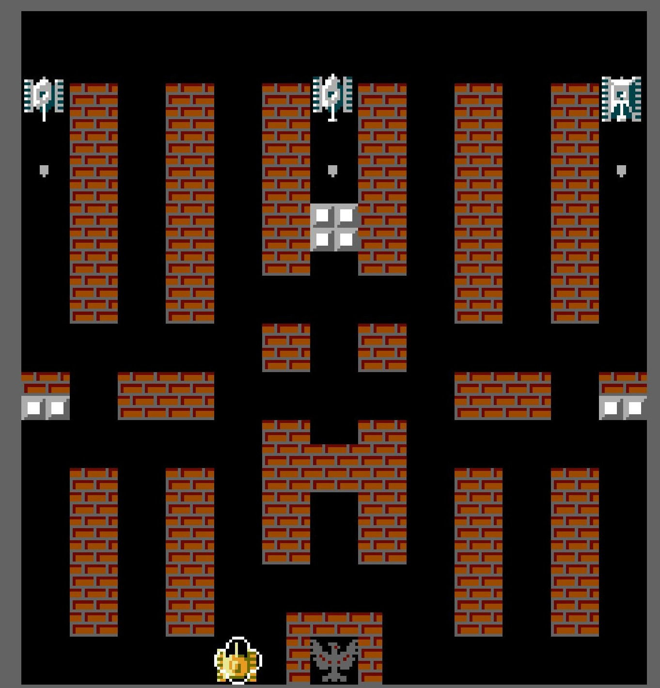

# Battle City Engine
it's a simple cross-platform 2D game made from scratch on C++ using OpenGL.
{width=200 height=200}
## Installation
You'll need Cmake
```bash
cd Battle_City_Engine
mkdir build
cmake ..
cmake --build .
```
For Ubuntu also download this
```bash
sudo apt-get install xorg-dev libglu1-mesa-dev
```
## Acknowledgment
Special Thanks to Aleksandr [SimpleCoding](https://www.youtube.com/@SimpleCodingChannel) for great tutorials
